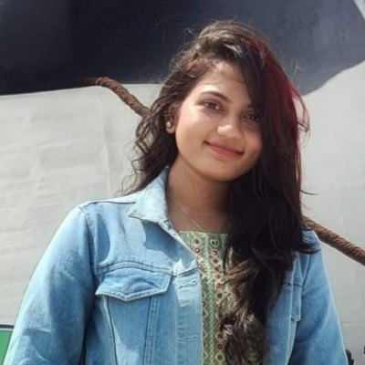

# Yashaswini sarabu

My favourite book is "The Vampire Diaries". It is a popular young adult book series written by L.J. Smith. The series revolves around the supernatural happenings in the fictional town of Mystic Falls and follows the love triangle involving the protagonist, Elena Gilbert, and the vampire brothers Damon and Stefan Salvatore. What sets this series apart is its combination of romance, drama, and the supernatural, captivating readers with its compelling characters and intricate plot twists. The success of the books led to the creation of a hit television series adaptation that further expanded the franchise's popularity.

